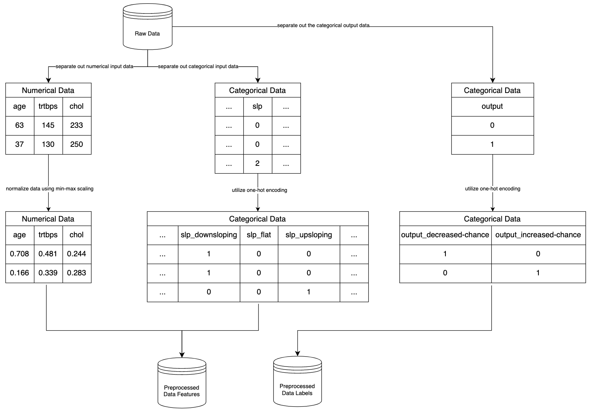
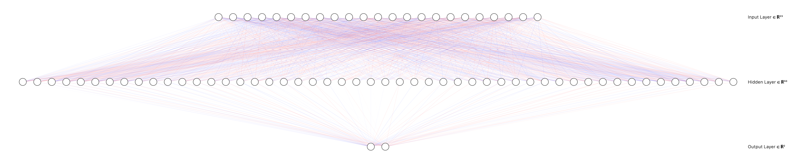
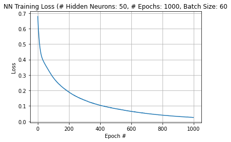

# Final Project - Heart Attack Risk Classification Using Multi-Layer Neural Network

---
**Author**: Luis Retana
\
**Course**: Data Analytics Using Python, Winter 2023

---

## **Introduction & Project Overview**
This project will attempt to develop an accurate model to aid in identifying healthcare patients that exhibit signs of increased heart attack risk. The incoming dataset contains real-life patient stats regarding various health metrics surround heart health, such as resting blood pressure (`trtbps`) and cholesterol (`chol`). The "target" variable of this dataset is a binary classification (`output`) that labels the patient as being exhibiting a lower versus higher risk of heart attack.


A multi-layer neural network will be used to uncover higher-dimensional relationships that form reliable markers of heart attack risk.

### **Problem Statement/Goal**
* Determine whether or not the specific record **classifies** as increased risk for heart attack or not with **>75% accuracy**

### **Tech Stack**
* **Development Environment(s):**
    * OS/Machine: Mac OS X
    * Python: Jupyter via Anaconda
* **Languages:**
    * Python
* **Frameworks/Libraries:**
    * **NumPy** - Harness library's ability to handle n-dimensional data objects and perform operations on these data objects (e.g., `np.argmax()`)
    * **Pandas** - Harness library's ability to hold, organize, and manipulate `DataFrame` objects representing datasets. To be used extensively in **Data Preprocessing/Preparation** phase of solution.
    * **Scikit-Learn** - utility functions such as `train_test_split()`
    * **Matplotlib & Seaborn** - Plotting libraries to be used in plotting model performance, in addition to exploratory data analysis.
    * **TensorFlow** - End-to-end machine learning framework used to build and run machine learning models, in this case, a deep learning neural network.
    * **Keras** - A higher-level interface to develop neural networks. Built on top of **TensorFlow**.

## **Solution/Method**
The following sections will cover the method used in developing the neural network solution:
1. Data Acquisition
2. Data Preprocessing/Preparation
3. Model Selection and Training
4. Model Performance and Observations

### **1. Data Acquisition**
Dataset repository used:
* **Name**: Heart Attack Analysis & Prediction Dataset - A dataset for heart attack classification<sup>1</sup>
* **URL**: https://www.kaggle.com/datasets/rashikrahmanpritom/heart-attack-analysis-prediction-dataset

Here is a breakdown of the data available in the Kaggle data repo linked to above (Additional details surrounding the columns/variables above attained from UCI Machine Learning Repository<sup>2</sup>: https://archive.ics.uci.edu/ml/datasets/Heart+Disease):

| Variable    | Data Type - Description |
| ----------- | ----------- |
|`age`|**numeric** - Age of the patient|
|`sex`|**categorical** - Sex of the patient (0 = female, 1 = male)|
|`cp`|**categorical** - Chest Pain type chest pain type (1 = typical angina, 2 = atypical angina, 3 = non-anginal pain, 4 = asymptomatic)|
|`trtbps`|**numeric** - resting blood pressure (in mm Hg)|
|`chol`|**numeric** - cholesterol in mg/dl fetched via BMI sensor|
|`fbs`|**categorical** - fasting blood sugar > 120 mg/dl (1 = true; 0 = false)|
|`restecg`|**categorical** - resting electrocardiographic results (0 = normal, 1 = having ST-T wave abnormality, 2 = showing probable or definite left ventricular hypertrophy by Estes' criteria)|
|`thalachh`|**numeric** - maximum heart rate achieved|
|`exng`|**categorical** - exercise induced angina (1 = yes; 0 = no)|
|`oldpeak`|**numerical** - ST depression induced by exercise relative to rest
|`slp`|**categorical** - the slope of the peak exercise ST segment (0 = downsloping, 1 = flat; 2 = upsloping)
|`caa`|**numeric** - number of major vessels (0-3)|
|`thall`|**numeric** -  ??? unsure but appears to denote normal vs fixed defect vs reversable defect|
|`output`|**categorical** -  classification (0 = less chance of heart attack, 1 = more chance of heart attack)|


### **2. Data Preprocessing/Preparation**
With a neural network architecture in mind, raw data was cleaned and preprocessed into a format suitable for input into a neural network model.

Due to the computational nature of neural networks, **categorical variables** were preprocessed so that they can be represented in a numeric format suitable for the neural network to operate on. Care should be taken so that this numeric representation of the categorical variable does not lose the "meaning" of the original variable and not "skew" the dataset (e.g, `slp` categorical variable). For this dataset, categorical data columns are translated into multiple numeric columns using **one-hot encoding**. Instead of having a single column, multiple columns are generated each representing one category of the original data column. For example, for the `slp` categorical data columns, there are 3 possible categories represented by discrete values:
* `0` - *downsloping*
* `1` - *flat*
* `2` - *upsloping*

Using one-hot encoding the singular `slp` categorical column with (with values `0`, `1`, `2`) is now represented by columns `slp_downsloping`, `slp_flat`, and `slp_upsloping` each with either `0` or `1` value in data rows denoting "ye/no" states. A benefit of this approach is that bias is minimized as categories now have an more even weight. For example, in the original `slp` categorical column, the neural network may see the category represented by `2` (i.e., *upsloping* category) as having more value/weight as `0` (i.e., *downsloping* category). After one-hot encoding of the `slp` column into multiple binary columns, the neural network will see each column as having equal weight with minimal bias. Here was the process used:
1. Identify categorical columns
2. Replace numeric value (e.g.,for `slp`, `0`, `1`, `2`) with string representation of the category name (e.g., for `slp`, `downsloping`, `flat`, and `upsloping`). (This is to later facilitate the generation of the one-hot columns so that column names are more readable)
3. Perform one-hot encoding on each column


Similarly, **numerical variables** need to be preprocessed to remove a similar type of bias. This includes normalizing them so that columns with varying data ranges do not overpower other columns. Normalization transforms a column so that its values fall within the range of [0,1] instead of [a,b]. In this solution, this meant:
1. For each column in dataset, compute new datum values using `new_value = (orig_value - column_min_value) / (column_max_value - column_min_value)`

No data preprocessing was needed to handle null/missing values as raw dataset did not contain any.

Overall, the preprocessing process it outlined in the diagram below:

<figure>
    
    <figcaption style="text-align:center"><i>Data Preprocessing Overview (Design using Diagrams.net<sup>3</sup></i></figcaption>
</figure>

### **3. Model Selection and Training**

#### **Model**
Model used for this research paper is a custom-built **Sequential, N-layer Neural Network**. Model was fed cleaned and preprocessed data instead of the raw data. This "preprocessed" input dataset spanned **23 columns**:

| Preprocessed Variable Name   | Derived from Raw Variable |
| ----------- | ----------- |
|`age`|`age`|
|`trtbps`|`trtbps`|
|`chol`|`chol`|
|`thalachh`|`thalachh`|
|`oldpeak`|`oldpeak`|
|`caa`|`caa`|
|`thall`|`thall`|
|`sex_female`|`sex`|
|`sex_male`|`sex`|
|`cp_asymptomatic`|`cp`|
|`cp_atypical-angina`|`cp`|
|`cp_nonanginal`|`cp`|
|`cp_typical-angina`|`cp`|
|`fbs_gt-120`|`fbs`|
|`fbs_lte-120`|`fbs`|
|`restecg_left-ventricular-atrophy`|`restecg`|
|`restecg_normal`|`restecg`|
|`restecg_st-abnormality`|`restecg`|
|`exng_no`|`exng`|
|`exng_yes`|`exng`|
|`slp_downsloping`|`slp`|
|`slp_flat`|`slp`|
|`slp_upsloping`|`slp`|

while the output dataset spanned **2 columns**:
| Preprocessed Variable Name   | Derived from Raw Variable |
| ----------- | ----------- |
|`output_decrease-chance`|`output`|
|`output_increase-chance`|`output`|

#### **Model Architecture**

After, numerous experiments with the models hyper-parameters (e.g., number training iterations, training batch sizes, number of hidden layers, number of hidden neurons in hidden layers, etc.), the below outlines the best observed model trained for this dataset:

* Layers
    * Number of Hidden Layers: 1
* Number of Neurons per Layer:
    * Input Layer: 23
    * Hidden Layer: 50
    * Output Layer: 2
* Activation Function Used:
    * At Hidden Layer -> Rectified Linear Unit (ReLu) 
    * At Output Layer -> Softmax
* Loss Function
    * Categorical Cross Entropy

<figure>
    
    <figcaption style="text-align:center"><i>Neural Network Architecture (Generated using NN-SVG<sup>4</sup>)</i></figcaption>
</figure>


### **4. Model Performance and Observations**
During training iterations of the neural network, **categorical cross entropy** was used to calculate the "loss" of the neural networks predictions as it "learned" the training dataset. This "loss" is used internally by the neural network to adjust its internal calculations so that later training iterations/epochs yield more accurate results. At the end of **1000** training iterations/epochs, the neural network model arrived at a total error of **0.03246**:

<figure>
    
    <figcaption style="text-align:center"><i>Neural Network Performance w/ 1 Hidden Layer w/ 50 Neurons and Batch Size of 60</i></figcaption>
</figure>

Through trial and error across different combinations of hyper-parameters, the final model delivered its best results with the settings mentioned in the prior section (see **Model Architecture**).

Performance was measured in terms of accuracy (number of exact matches between predicted and actual output divided by total number of records). Confusion matrices were used to drilldown into this accuracy. Recall, a confusion matrix reports on the number of true positives, true negatives, false positives and false negatives. For this, dataset the confusion matrix looks as such:

||1 - increased chance heart attack (actual)|0 - decreased chance heart attack (actual)|
| ------ | ------ | ------ |
|**1 (predicted)**| <span style="color:green">true positive</span>|<span style="color:red">false negative</span>|
|**0 (predicted)**| <span style="color:red">false positive</span>|<span style="color:green">true negative</span>|

Performance on training data (**70%** of the preprocessed data used for training the model):
```
Confusion Matrix:
[[101   0]
 [  1 110]]
Accuracy Score: 0.9952830188679245
```
* In other words, the model reached **99.53% accuracy** with **211 correct classifications out of 212 possible** by the end of its training phase.

Performance on testing data (**30%** of the preprocessed data used for training the model):
```
Confusion Matrix:
[[29  8]
 [ 7 47]]
Accuracy Score: 0.8351648351648352
```
* In other words, the trained model from above reached **83.52% accuracy** with **76 correct classifications out of 91 possible** when being fed testing data it has never seen before.

#### **Observations**
* Experimentation with neural network hyper-parameters reveal the following factors appeared to adversely affect loss and accuracy metrics when set too low or too high:
    * Number of hidden layers
    * Number of hidden layer neurons
    * Batch Size

    For example, using more than one hidden layer and/or using high number of neurons in the hidden layer(s) (e.g., more than 60 neurons) appeared to actually decrease accuracy. This may be a sign that perhaps the model was "overtraining", a symptom where "*...the neural network is too powerful for the current problem. [It] does not "recognize" the underlying trend in the data, but learns the data by heart (including the noise in the data)*"<sup>5</sup> In other words, when a model starts overtraining, it begins to "memorize" the training datasets instead of "understanding" and developing useful insights and generalizations that can help it perform accurately on data it has never seen before.


## Summary & Future Work
With the goal of the model being met (achieving **83.52%**...more than the goal of **> 75% accuracy**), ideas for model performance gains are outlined below:
* Perhaps standardizing numeric values can yield more accurate results than normalizing them.
* Trimming down the columns used so that only columns with a stronger correlation of **< -0.5** and **> 0.5** (with respect to the target variable) are used may increase accuracy
* Expanding the number of columns AND number of data records in the dataset may have yielded more accurate results as well. For example, if we had more columns covering over health metrics covering:
    * Previous Smoker?
    * Previous Recreational Drug Use?
    * Occupation (coal miner, railroad worker, web developer)
    * Hormonal Health Panel (testosterone, estrogren, insulin, etc.)
    * Metabolic Health Panel
    * Body Mass Index
    * Weight

    among others, perhaps more accurate results would be easily achieved as the neural network may uncover more important factors to the heart attack rick equation. The added number of records would help give the model more observations to training one to reveal more insights and patterns in the data.

## **Sources**
1. https://www.kaggle.com/datasets/rashikrahmanpritom/heart-attack-analysis-prediction-dataset
2. https://archive.ics.uci.edu/ml/datasets/Heart+Disease
3. https://app.diagrams.net/
4. https://alexlenail.me/NN-SVG/index.html
5. http://www.statistics4u.com/fundstat_eng/cc_ann_generalization.html 

